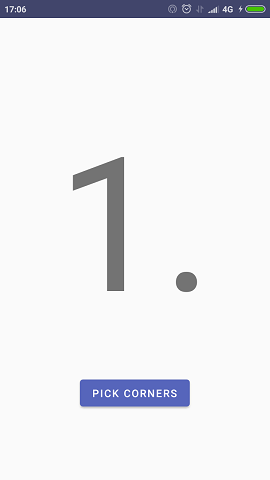
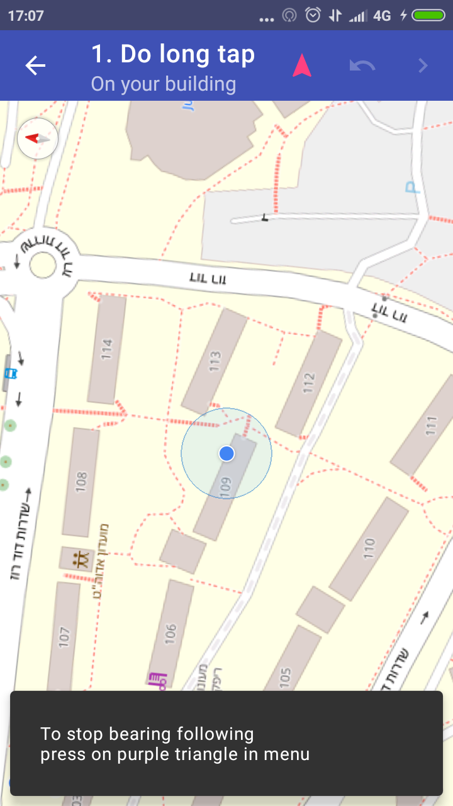
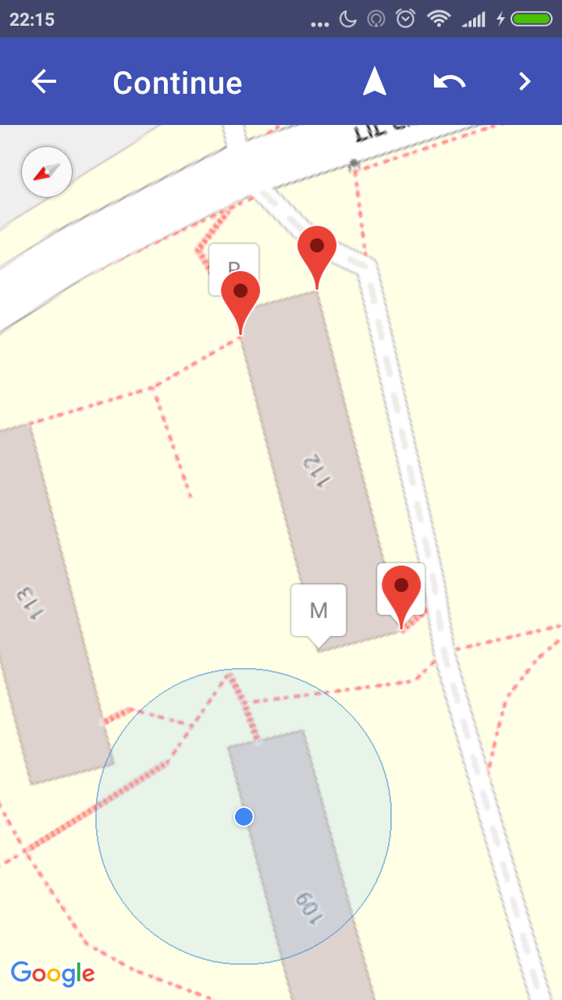
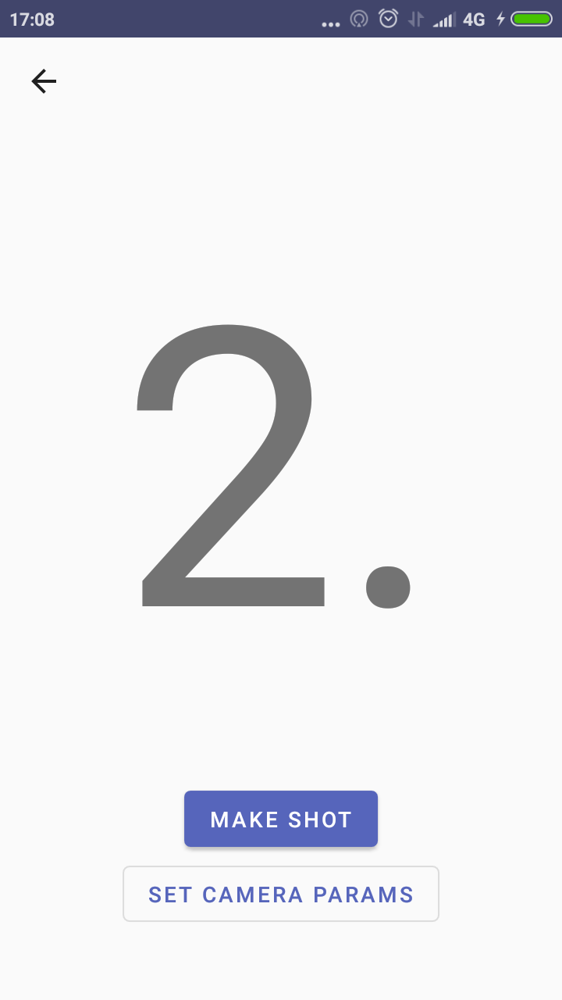
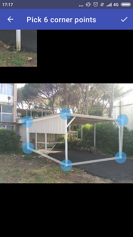

# OpenStreetHeight

OpenStreetHeight (OSH) - implementation of building height calculation algorithm.

Algorithm developed by masters student Eliana Bshouty under guidance of prof Sagi Dalyot.

**Note:** work in progress


## Structure

App is comprised of two parts: client (Android app) and server (Java).

### Client (Android)

Android app is built via MVP pattern.

App is structured into sections, each section has Presenter and View.

Each section is autonomous and can be tested separately.

Communication between presenters is done via MessageHub.

If presenter needs to change current section, it calls Router.

Each section is represented by Fragment hosted in MainActivity. 

### Server (Java)

Server app is built on top of Ratpack library.

Communication with client is done via JSON.

## Screenshots
| | |
:-------------------------:|:-------------------------:
  |  
  |  
  |  
  | 

## License

```
MIT License

Copyright (c) 2019 Eliana Bshouty, Sagi Dalyot and Alex Shafir

Permission is hereby granted, free of charge, to any person obtaining a copy
of this software and associated documentation files (the "Software"), to deal
in the Software without restriction, including without limitation the rights
to use, copy, modify, merge, publish, distribute, sublicense, and/or sell
copies of the Software, and to permit persons to whom the Software is
furnished to do so, subject to the following conditions:

The above copyright notice and this permission notice shall be included in all
copies or substantial portions of the Software.

THE SOFTWARE IS PROVIDED "AS IS", WITHOUT WARRANTY OF ANY KIND, EXPRESS OR
IMPLIED, INCLUDING BUT NOT LIMITED TO THE WARRANTIES OF MERCHANTABILITY,
FITNESS FOR A PARTICULAR PURPOSE AND NONINFRINGEMENT. IN NO EVENT SHALL THE
AUTHORS OR COPYRIGHT HOLDERS BE LIABLE FOR ANY CLAIM, DAMAGES OR OTHER
LIABILITY, WHETHER IN AN ACTION OF CONTRACT, TORT OR OTHERWISE, ARISING FROM,
OUT OF OR IN CONNECTION WITH THE SOFTWARE OR THE USE OR OTHER DEALINGS IN THE
SOFTWARE.
```
