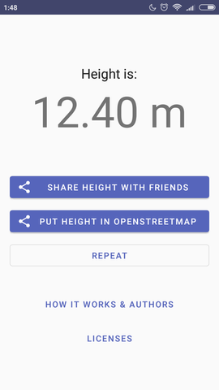

# OpenStreetHeight

OpenStreetHeight (OSH) - implementation of **building** height calculation algorithm.

Algorithm developed by masters student Eliana Bshouty under guidance of prof Sagi Dalyot.

**Note:** work in progress, but still can be compiled & run

## Idea
Measure height of building only via photo.

Currently user also needs to pick building on map and its closest 3 corners.  
But it will be fixed in next versions, so that you only need to make photo.

Limitations of this method:
- Building should already be present in OpenStreetMap
- In Android Camera API is not reliable, so you also should know camera focal distance and pixel size in advance

## Install & Run
Server JAR and startup script are located in [DEPLOYMENT](https://github.com/AlexShafir/OpenStreetHeight/tree/master/DEPLOYMENT) folder

APK can be downloaded [here](https://github.com/AlexShafir/OpenStreetHeight/raw/master/DEPLOYMENT/OSH.apk)


## Structure

App is comprised of two parts: client (Android app) and server (Java).

### Client (Android-Java)

Android app is built via MVP pattern.

App is structured into sections, each section has Presenter and View.

Each section is autonomous and can be tested separately.

Communication between presenters is done via MessageHub.

If presenter needs to change current section, it calls Router.

Each section is represented by Fragment hosted in MainActivity. 

Dependency Injection was not used due to simplicity of project.

### Server (Java)

Server app is built on top of Ratpack library.

Communication with client is done via JSON.

Server is needed to run Matlab scripts (and Matlab Runtime takes too much disk space to ship it in mobile app).  
Rewriting scripts in different language would take too much time.

## Screenshots
| | |
:-------------------------:|:-------------------------:
  |  
  |  
  |  
  |  

## License

```
MIT License

Copyright (c) 2019 Eliana Bshouty, Sagi Dalyot and Alex Shafir

Permission is hereby granted, free of charge, to any person obtaining a copy
of this software and associated documentation files (the "Software"), to deal
in the Software without restriction, including without limitation the rights
to use, copy, modify, merge, publish, distribute, sublicense, and/or sell
copies of the Software, and to permit persons to whom the Software is
furnished to do so, subject to the following conditions:

The above copyright notice and this permission notice shall be included in all
copies or substantial portions of the Software.

THE SOFTWARE IS PROVIDED "AS IS", WITHOUT WARRANTY OF ANY KIND, EXPRESS OR
IMPLIED, INCLUDING BUT NOT LIMITED TO THE WARRANTIES OF MERCHANTABILITY,
FITNESS FOR A PARTICULAR PURPOSE AND NONINFRINGEMENT. IN NO EVENT SHALL THE
AUTHORS OR COPYRIGHT HOLDERS BE LIABLE FOR ANY CLAIM, DAMAGES OR OTHER
LIABILITY, WHETHER IN AN ACTION OF CONTRACT, TORT OR OTHERWISE, ARISING FROM,
OUT OF OR IN CONNECTION WITH THE SOFTWARE OR THE USE OR OTHER DEALINGS IN THE
SOFTWARE.
```
