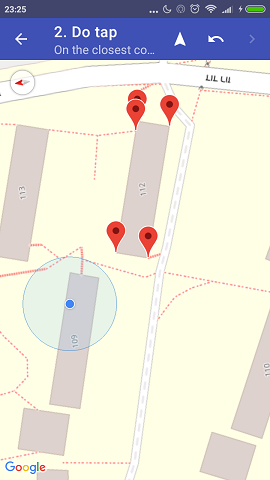
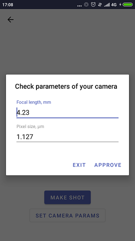

# OpenStreetHeight

OpenStreetHeight (OSH) - implementation of building height calculation algorithm.

Algorithm developed by masters student Eliana Bshouty under guidance of prof Sagi Dalyot.

## Structure

App is comprised of two parts: client (Android app) and server (Java).

Android app is built via MVP pattern.

Server app is built on top of Ratpack library.

## Screenshots
| Italic             |  Block letters |
:-------------------------:|:-------------------------:
  |  
  |  
  |  

